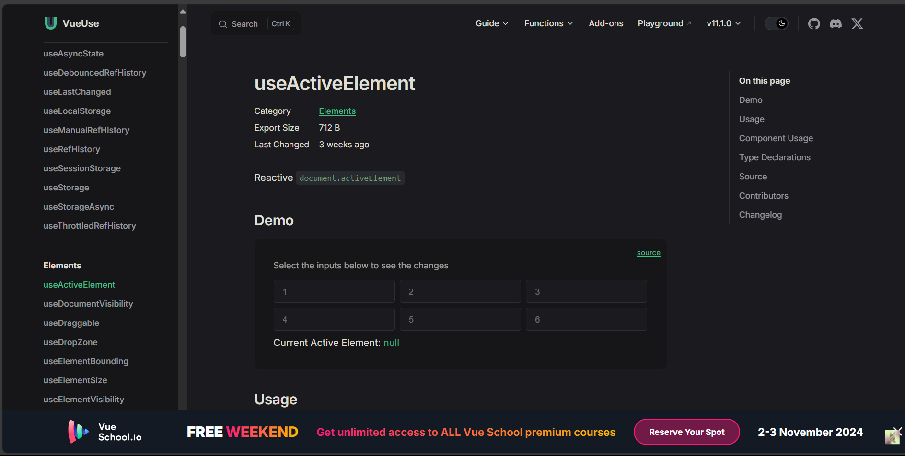
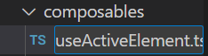
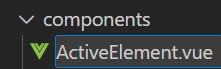
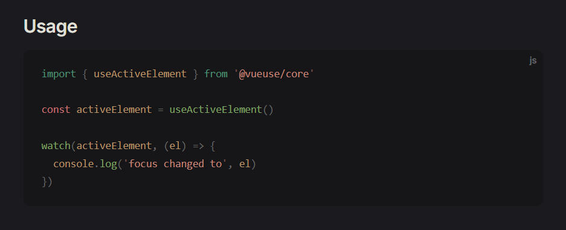
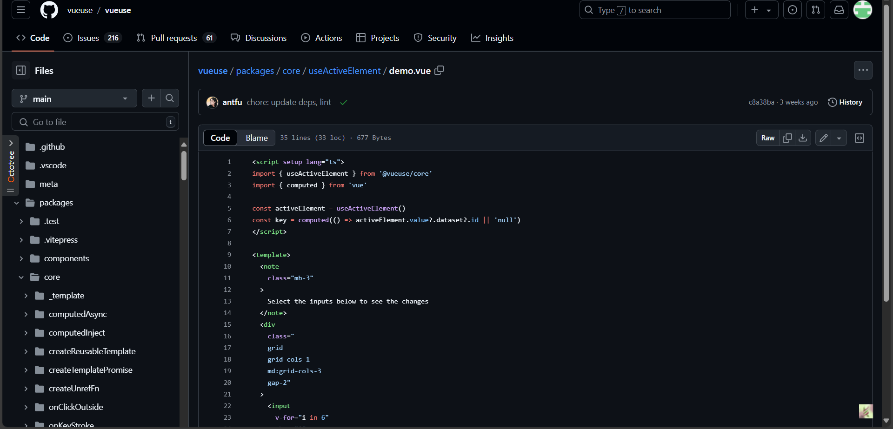
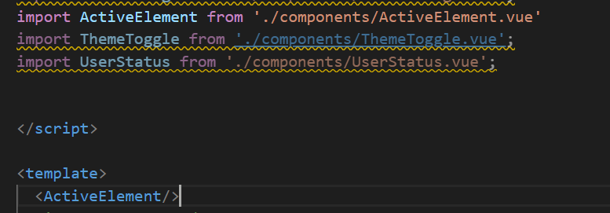
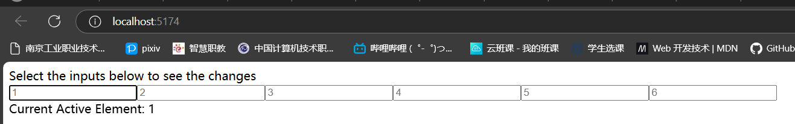

# vueuse的组件可以前往vueuse官网进行学习！
链接为：https://vueuse.org/functions.html#category=State
## 以下为一则练习演示：

选择自己想要的组件，例如这个useActiveElement
## 步骤
### 1，创建对应的 composable 和 component

### 2,上官网复制对应的代码
component位于右上角的source内，composable则在下方页面已经给出

### 3,app.vue 中引入 ActiveElement

### 4，运行npm，查看页面

运行成功！这就是vueuse组件的借用，个别组件还需要安装其它的vueuse库中的依赖，但总体不难，多多练习就好！